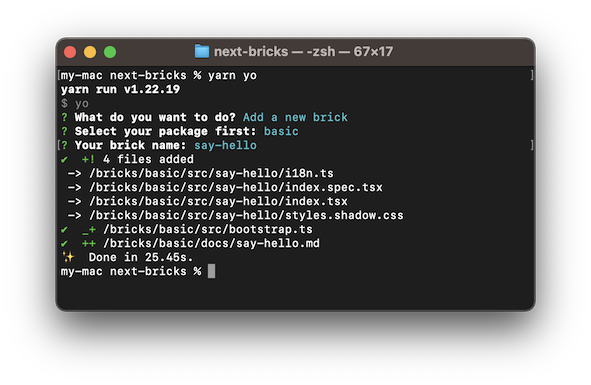
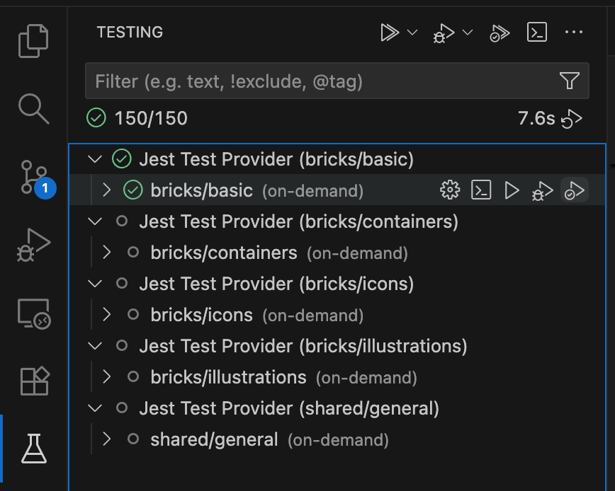
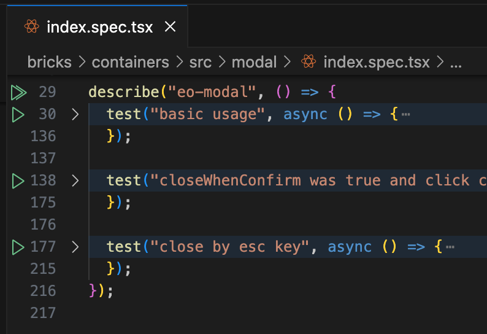
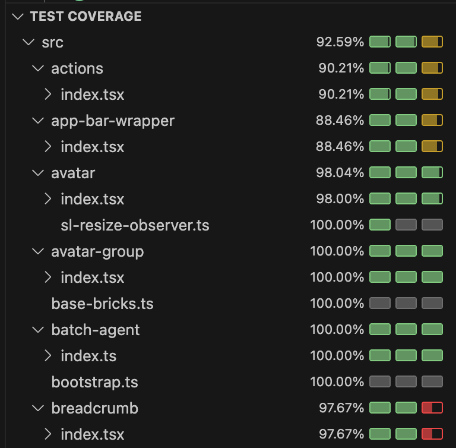
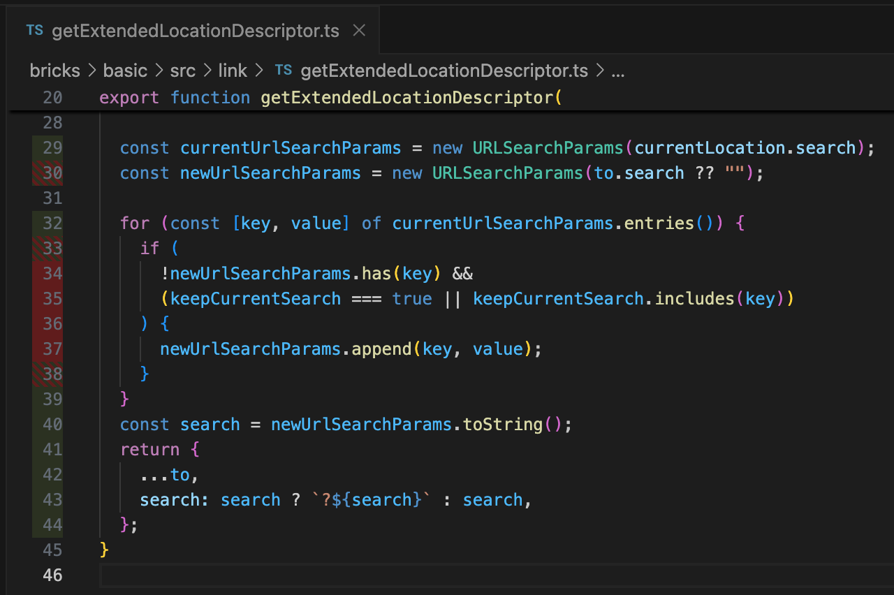

# 贡献指南

## 构件开发

### Playground

运行 `yarn serve:playground` 然后打开浏览器访问 `http://localhost:8082/`。

Playground 左侧可以编写 YAML 或 HTML 代码，右侧显示实时预览。可以下拉选择预设的示例，或选择 `- local -` 进行本地代码编写。

### Playground 示例

Playground 中的示例列表来自约定的示例文件和文档文件。

- 文档文件：`docs/*.md`
- 示例文件：`src/**/*/example.html` 或 `src/**/*/example.yaml`

**不再推荐使用单独的示例文件，建议迁移至文档文件。**

[点击查看构件文档的编写](#构件文档)。

### 新构件

运行 `yarn yo`，按提示输入，可以快速创建新构件（或新的构件包、provider）。



更多细节可以参考 [`bricks/basic/src/button/index.tsx`](bricks/basic/src/button/index.tsx) 实现。

> **注意：**
>
> - 由于我们采用了 [Module Federation](https://webpack.js.org/concepts/module-federation/)，构件文件需要在 `src/bootstrap.ts` 中引入。
> - 如果构件基于 `ReactNextElement`，其 `render()` 函数应直接返回一个 `JSX.Element`。
> - 目前 `ReactNextElement` 默认为 ShadowDOM 模式，样式文件需要使用 `*.shadow.css` 并在 `@defineElement` 中通过 `styleTexts` 传递进去。
> - 一次 `createDecorators()` 调用返回的装饰器，只能用于一个构件。
> - `@property()` 和 `@event()` 装饰器需要添加 [`accessor`](https://www.typescriptlang.org/docs/handbook/release-notes/typescript-4-9.html#auto-accessors-in-classes) 关键字，其中 `@event()` 需要使用 private 形式例如 `#clickEvent`。
> - 通常来说，构件的主插槽不要有名字，以便支持 TextNode 作为构件的子节点，同时方便 Visual Builder 做相关优化（作为默认插槽）。
> - 运行 lerna 命令时，最好始终加上 `npx` 来运行，例如 `npx lerna run build`。

### 预览和调试

先启动构件的实时打包 `npx lerna run start --scope @next-bricks/basic`，然后参考前一章节启动 playground。

### 与远端服务联调

使用 `yarn serve` 可以与远端服务联调。默认使用所有本地发现的构件包，使用 `--local-bricks=abc,xyz` 来单独指定要使用的本地构件包。其他选项参数请运行 `yarn serve --help` 查看。

默认情况下，`yarn serve` 会从项目的 `node_modules/@next-bricks` 和 `node_modules/@bricks` 目录中查找本地构件包，因此，如需调试其他仓库的构件包，可以使用 `yarn link` 将其链接到本项目中。

另外，也可以创建 `dev.config.mjs` 文件来按需指定构件包所在目录：

```js
// File: dev.config.mjs
// @ts-check
/** @typedef {{ featureFlags?: Record<string, boolean>; misc?: Record<string, unknown>; [k: string]: unknown; }} Settings */
/** @type {{ brickFolders?: string[]; settings?: Settings }} */
export default {
  brickFolders: [
    // 默认使用 `node_modules/@next-bricks` 及 `node_modules/@bricks` 作为构件包目录。
    "node_modules/@next-bricks",
    "node_modules/@bricks",

    // 引用其他仓库的构件包。注：可使用通配符，详见 https://github.com/isaacs/node-glob
    "../next-*/bricks",
  ],
  // 还可以设置一些特性开关（覆盖远端服务器的特性开关设置）
  settings: {
    featureFlags: {
      "some-local-feature-flag": true,
    },
  },
};
```

注意：现在可以在 v3 仓库中使用 `yarn serve:playground` 并配合 `dev.config.mjs` 来在本地调试其他仓库（包括 v2）的构件属性编辑器，如上按需配置 `brickFolders` 即可。

### SVG

在构件 JS/TS 代码中引入 SVG 文件时，默认会像 PNG/JPEG 一样打包成图片资源文件，例如：

```jsx
import MySvg from "./my.svg";

// MySvg 是图片地址
;
```

有时候我们希望同时控制这些 SVG 内部的一些元素的样式，这时可以在 `build.config.js` 中启用 `svgAsReactComponent`，将 SVG 转换为 React 组件，例如：

```js
// File: build.config.js
// @ts-check
/** @type {import("@next-core/build-next-bricks").BuildNextBricksConfig} */
export default {
  svgAsReactComponent: true,
};
```

```tsx
// File: src/my-brick/index.tsx
import MySvg from "./image.svg";

// MySvg 是 React 组件
<MySvg className="my-icon" />;
```

```css
/* File: src/my-brick/styles.shadow.css */
.my-icon path {
  fill: green;
}
```

当一个构件包启用 `svgAsReactComponent` 后，如果希望某些指定 SVG 仍按原图片资源处理的，可以添加 [resource query](https://webpack.js.org/configuration/module/#ruleresourcequery)，例如：

```tsx
// 末尾添加 `?url`
import MySvgUrl from "./image.svg?url";
import MySvgComp from "./icon.svg";

// MySvgUrl 是图片地址


// MySvgComp 是 React 组件
<MySvgComp />
```

## 构件文档

构件文档由手工编写的 markdown 文档和写在源代码中的注释共同组成。手工编写的文档主要提供场景化的示例，而源代码中的注释主要提供构件的属性、插槽、事件和方法等 API 的说明。

### Markdown 文档

手工编写的文档统一放在各个构件包内的 `docs` 目录中，以构件名（不带点号前的 namespace）作为文件名编写 markdown，可参考 [bricks/basic/docs/eo-button.md](bricks/basic/docs/eo-button.md)。

该 markdown 文档的第一部分内容主要描述构件的用途，可以附上基本的示例。

第二部分是场景化示例列表，示例应进行分类，每个分类的标题使用第三级标题，例如 `### Types`。如有需要，分类中可以有附带描述说明性内容，每个分类也可以有多个示例。

示例可以通常用 YAML 编写。

使用 ` ```html preview ` 或 ` ```yaml preview `标注的代码块，可以在文档中实时预览、并在 playground 中作为示例。例如：

````md
```html preview
<eo-button type="primary">I'm a button</eo-button>
```
````

我们提供了示例 YAML 与 HTML 之间的自动的相互转译，开发者可以只编写其中一种，文档站点上用户可以自由切换示例语言。

为了使 YAML 与 HTML 的自动转译正常工作，示例的编写有一些规则需要遵守：

- 不要在 HTML 中使用 `<script>`，涉及复合属性和事件的编排请使用 YAML；
- 事件配置中尽量只使用 `console.*`、`message.*` 或调用构件方法、设置构件属性；
- 不要使用表达式，除了在事件中简单引用 `<% EVENT %>` 或 `<% EVENT.detail %>` 或 `<% EVENT.target %>`。

提示：如果一个示例中需要平铺多个行内（inline or inline-block）构件，如果使用 YAML 渲染，由于元素之间不像一般的 HTML 那样有一个间隔的空白，这些元素可能会挤在一起，为避免这种问题，可以为代码块再添加一个 meta 字段 `gap`，例如：

````md
```yaml preview gap
- brick: eo-button
- brick: eo-button
- brick: eo-button
```
````

如果使用 HTML 格式编排这种场景，仍然建议标注 `gap`，这样可以避免用户切换至自动转译的 YAML 时出现问题。

### 源代码注释

构件基本信息通过注释写在构件定义之前，例如：

```ts
/**
 * 通用弹出层构件
 *
 * @author sailor
 *
 * @slot - 弹出层内容
 * @slot anchor - 触发弹出层的元素
 *
 * @part arrow - 气泡指向箭头
 */
@defineElement("eo-popover")
class Popover extends ReactNextElement {}
```

> **注意**：相比于 v2 构件的注释，v3 构件的注释将尽量遵循 JSDoc 的惯例，并移除了一些冗余的注释字段。例如：
>
> - 不再填写 `@description`，而是将说明内容直接写在第一段正文中；
> - 也不再填写 `@id` `@name` `@kind` 等信息，这些信息将从源代码中自动识别；
> - 布尔类型的字段，例如 `@required`，不填写表示 `false`，填写 `@required` 时表示 `true`

属性、事件和方法的定义：

```ts
class Popover extends ReactNextElement {
  /**
   * 弹出层如何定位
   * @default "absolute"
   */
  @property()
  accessor strategy: "absolute" | "fixed" | undefined;

  /**
   * 当弹出层可见性变化时触发
   * @detail 当前是否可见
   */
  @event({ type: "visible.change" })
  accessor #visibleChangeEvent!: EventEmitter<boolean>;

  /**
   * 显示弹出层
   */
  @method()
  toggle(active: boolean): void {
    // ...
  }
}
```

对于属性，其默认值可以从代码中自动识别，但如果默认值的逻辑在其他地方实现，则需要填写 `@default xxx`，例如：

```ts
/** ... */
@property({ type: Boolean })
accessor active: boolean | undefined = false;

/**
 * ...
 * @default "absolute"
 */
@property()
  accessor strategy: "absolute" | "fixed" | undefined;
```

对于事件 `detail` 字段的 TS 类型，将自动从源代码中识别，例如，如果事件对应的类型为 `EventEmitter<boolean>`，则其 `detail` 的 TS 类型为 `boolean`。

对于关键特性直接使用原生事件的构件，应主动在注释中声明，以便在文档中显示，例如按钮构件的点击事件：

```ts
/**
 * 按钮
 *
 * @event click - 点击
 */
@defineElement("eo-button")
```

对于方法，其参数类型和返回类型也都将自动从源代码中识别。

## 测试

框架提供的测试命令是封装的 [Jest](https://jestjs.io/)，可以使用大部分 Jest 支持的参数。

```bash
# 测试指定包
yarn test bricks/basic

# 测试指定文件，并 watch
yarn test bricks/basic/src/button/index.spec.ts --watch
```

### VS Code

对于 VS Code 用户，可以使用更便捷和集成化的测试能力，按如下初始化准备：

1. 安装 [vscode-jest](https://marketplace.visualstudio.com/items?itemName=Orta.vscode-jest) 插件
2. 运行 `yarn yo` 并选择 `Setup VSCode testing settings`

常见使用方式：

1. 在 Testing View 中运行指定的包/目录/文件的测试（可选 debug / with coverage / update snapshot 等模式）
2. 可以一键运行指定的测试用例/用例组
3. 可视化的测试覆盖率统计和标注
4. Copilot Agent 可使用该测试工具、并获取覆盖率等信息等帮助其验证和完善生成的代码和测试用例








